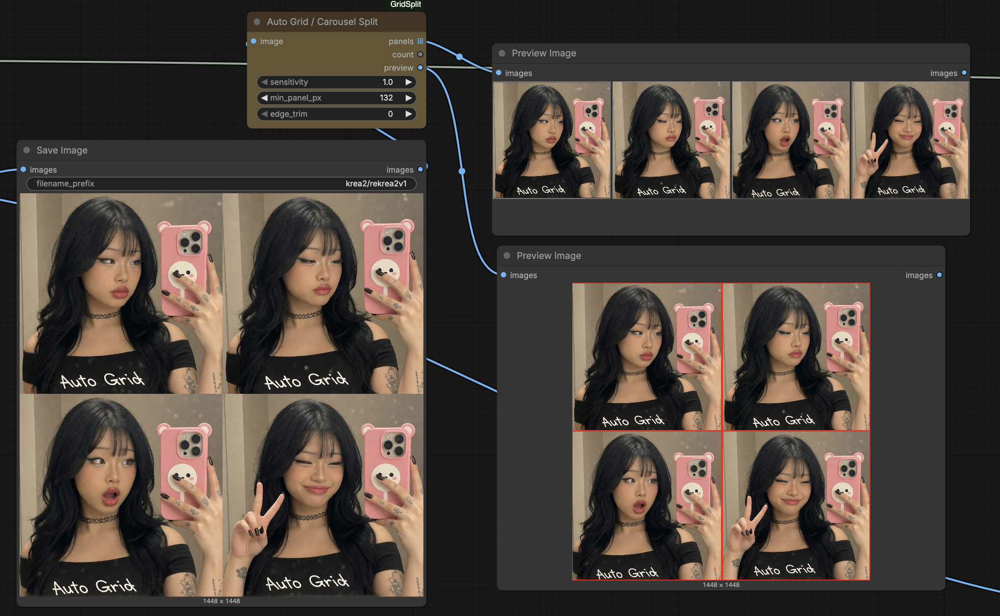
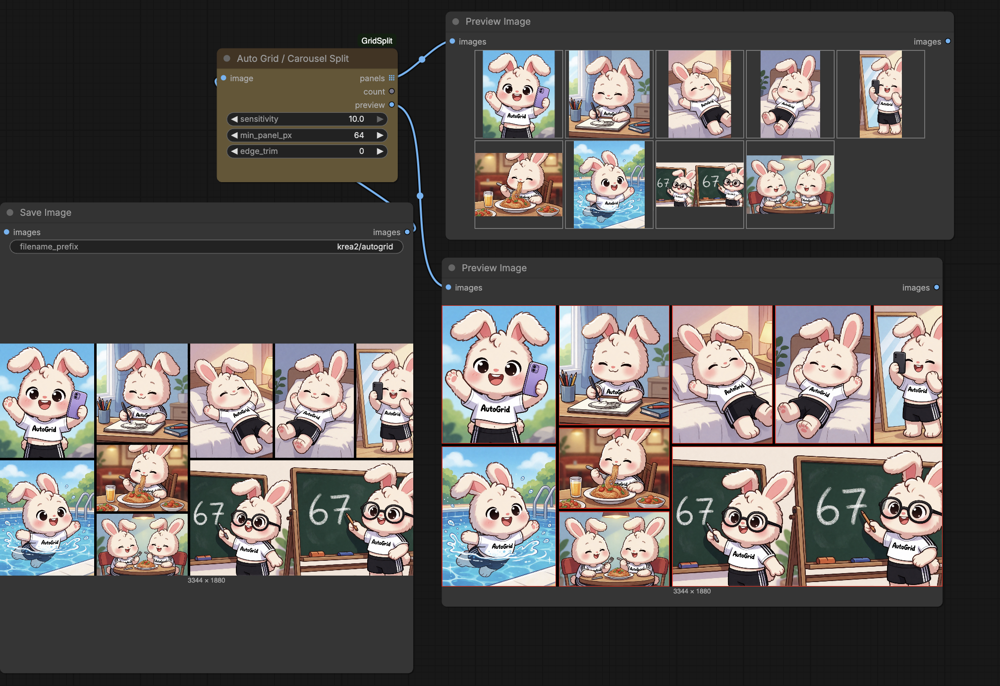

# ComfyUI-GridSplit

Two complementary grid tools for ComfyUI — **no model, no weights, CPU, any resolution:**

- **Auto Grid / Carousel Split** — detect how a stitched image is divided and split it into its panels.
- **Grid Stitch** — the inverse: repeat one image into an R×C grid, scaled to a target megapixels.

---

## Auto Grid / Carousel Split

Auto-detect how a stitched image is divided and split it into its individual panels.
Handles three kinds of layout automatically:

| Layout | example | how |
|---|---|---|
| **Regular grid** | 2×2 of variations | global seam projection |
| **Uneven grid** | 3 side-by-side, unequal widths | global seam projection |
| **Irregular collage** ("bento") | different split lines per region, a cell split again | recursive guillotine on the gutters |

It auto-routes: if the image has solid separator bands (black/white/any flat
gutter) it uses recursive guillotine decomposition (each region finds its own
local cuts, so irregular layouts work). If the panels are **seamless** (abut with
no gutter) it uses global row×column seam detection. Content edges (faces, text,
etc.) never trigger a split.

Validated: 2048² 2×2 → 4 tiles · 2728×1536 uneven 1×3 → 928/976/824 tiles ·
3344×1880 irregular 10-panel collage (incl. a column that's itself split in two).

## Examples

**Simple 2×2 grid → 4 clean panels** (bottom-right shows the `preview` output with detected boxes in red):



**Irregular collage → 10 panels** — note the bottom-middle cell is itself split into two, while the pool and chalkboards stay whole:



### Inputs / outputs

**Inputs**
| name | what |
|------|------|
| `image` | the stitched grid / carousel / collage |
| `sensitivity` | default 1 (standard). **Higher = splits more eagerly / catches weaker seamless seams.** Only affects the seamless path. |
| `min_panel_px` | reject any split that would make a panel smaller than this |
| `edge_trim` | shave N px off each panel edge (kills blend / halo / anti-aliased gutter fringe) |

**Outputs**
| name | what |
|------|------|
| `panels` | **list** of images (tiles keep their native size) → feed into SaveImage to write N files |
| `count` | number of panels detected |
| `preview` | the input with detected panel boxes drawn in red — for visual QA |

`panels` is a list because panels have different sizes and can't share one batch tensor.
A non-grid image passes through unchanged as a single panel.

---

## Grid Stitch

The inverse of the splitter: take one image you like and **repeat it into an R×C grid**,
scaled so the whole thing hits a target megapixel count. Cells preserve the image's
aspect ratio (no distortion) and tile seamlessly.

**Inputs**
| name | what |
|------|------|
| `image` | the image to tile (a batch of N fills the cells cyclically; a single image just repeats) |
| `rows`, `cols` | grid dimensions, e.g. 3×3 or 3×4 |
| `megapixels` | target **total** size of the stitched grid |
| `scale_method` | resampling filter — same set as ComfyUI's Upscale Image (`nearest-exact` / `bilinear` / `area` / `bicubic` / `lanczos`), default `bicubic` |

**Outputs**
| name | what |
|------|------|
| `grid` | the stitched grid image |
| `width`, `height` | final output dimensions |

Example: a 1448² image at **3×4 @ 4 MP** → a 2308×1731 grid, each cell ~577×577, no distortion.

---

## Grid Stitch Advanced

Stitch **multiple different images** (any sizes) into an R×C grid — exactly the way
ComfyUI's built-in **Stitch Images** does it (`match_image_size`): each image is
resized to match its neighbour's shared edge (aspect-preserved, lanczos), **no
padding**, so the result is a clean filled rectangle. Then scaled to a target megapixels.

**Inputs**
| name | what |
|------|------|
| `rows`, `cols` | grid dimensions (up to 8×8) |
| `megapixels` | target total size of the stitched grid |
| `scale_method` | resample filter (default `lanczos`) |
| `image_1 … image_16` | one image per cell, row-major (`image_1` = top-left). Empty cells → black |

**Outputs:** `grid`, `width`, `height`.

Use it to assemble already-generated scenes into a grid for Krea2 img2img, then
`Auto Grid / Carousel Split` to break the result back apart. (Phase 1: up to 16 cells
via numbered inputs; an interactive drag-arrange widget is planned.)

## Install
```bash
cd ComfyUI/custom_nodes
git clone https://github.com/workordie/ComfyUI-GridSplit.git
# restart ComfyUI
```
No dependencies beyond torch/numpy (already in ComfyUI).

## Example workflow
Drag [`example_workflows/autogrid_example.json`](example_workflows/autogrid_example.json)
onto the ComfyUI canvas — it generates an image and splits it, wiring `panels`
into SaveImage and `preview` into PreviewImage.
